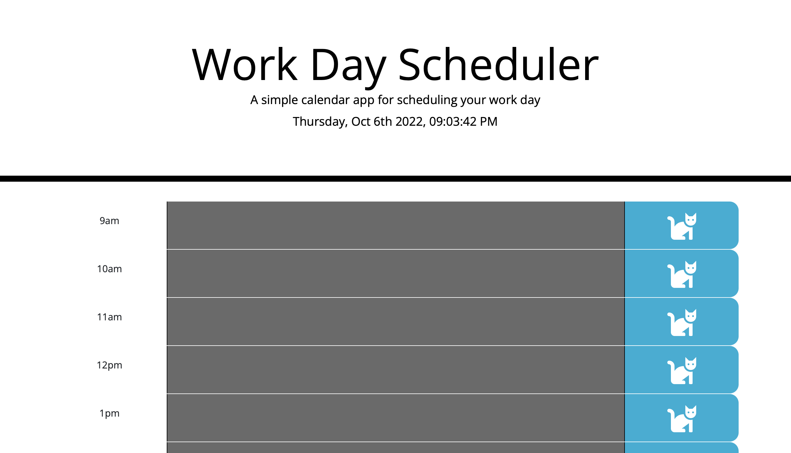

# DayPlanner

A simple JavaScript App to store events based on hours of typical work day.
***
*[plz press cat to save your event]*
***
This is a Day Planner that is able to store event datas/notes onto user's local storage within their browser.

It also utilizes moment.js to automate the hour which are in the past *(grey)*, present *(red)*, and future *(green)*.

I was provided starter code of html and css. And I was tasked with creating the javascript file.
***
## Goals
Ask: Create a day planner where elements are dynamically generated and tied to a third party API for the current time, where I can store information that persist upon refresh

- [X] the current day is displayed at the top of the calendar
- [X] timeblocks for 9 - 5 (inlcuding 5)
- [X] timeblocks are color coded based on past, present, future
- [X] click to enter an event (textarea)
- [X] storing event content into local storage with button

***
## Method
I tacked the implementation of moment first, to create the ticking timer under the header of the webapp.

Then I created a function that dynamically generate a `<p>`, `<textarea>`, `<button>` within a `<div>` container on the page using an iteration for the typical working hour *[9am ~ 5pm]*. During the iteration, I had also included tags in military time *[9:00 ~ 17:00]*. so we can use that as an identifyer later on to decide the colors and other functions. 

Then when it comes to deciding the color of the block based on time, I utilized the following logic to decide if a timeblock's time state:
```javascript
`h = the military time ID
currentH = the current military time pulled from moment.ls` 
var present = (h == currentH);
var past = (h < currentH);
var future = (h > currentH);
```
These variable would return a boolean value of true or false, based on the comparison. 

I then added the functionality of the button, to store the ID of the button and the text of the previous textarea elemnt onto local storage, so it can be displayed even after a webpage reload. 


***
## Demo Links / Media
*(feel free to click on the gif to go to deployed site)*
[](https://draconmarius.github.io/DayPlanner/) 

## Technologies Used
> JavaScript
> jQuery
> bootstrap
> moment.js

## License
> MIT

---

## Contact
Feel free to contact me @ the following:

[](https://github.com/DraconMarius) 

[](https://www.linkedin.com/in/mari-ma-70771585/)  

[Icon credit @ Anton Kalashnyk](https://icon-icons.com/users/14quJ7FM9cYdQZHidnZoM/icon-sets/)